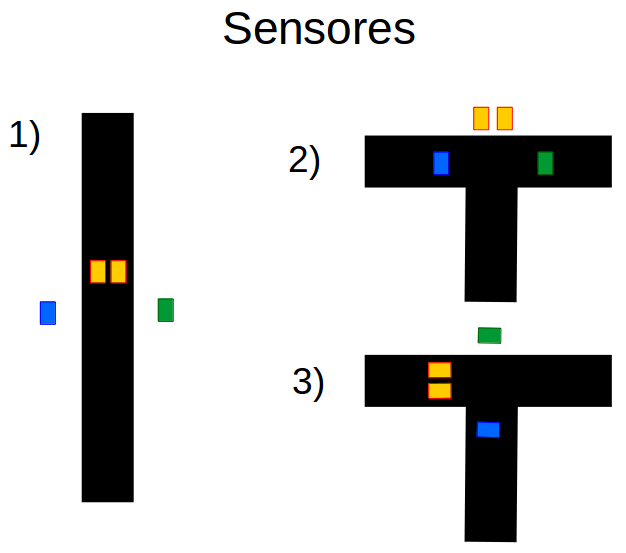

## Robot que resuelve laberintos usando una función recursiva.

### Videos (Click para ver)

Sin sensor ultrasónico

Con sensor ultrasónico

	

----------------------------------------------------------------

### Equipo
- Arduino
- 2 Motores y chasis
- 4 sensores CNY70 [en configuración A](http://www.nextiafenix.com/wp-content/uploads/2016/03/CNY70_3.png) con resistencias de 220Ohms para el LED y 47K para el foto transistor (o una barra de sensores)
- Laberinto con lineas rectas y bifurcaciones también en linea recta (dos sentidos)
- Sensor ultrasónico

----------------------------------------------------------------

### Funcionamiento

Se colocan 2 sensores a los lados y 2 sensores frontales que siguen la linea (en relación a los otros se comportan como uno solo).

Se tienen 3 casos:

1) Si los sensores laterales detectan blanco sigue la linea con los sensores frontales.
2) Si los sensores laterales detectan negro y alguno de lo los 2 sensores frontales detecta blanco esta en una bifurcación y elige al azar que ruta tomar.
3) Si esta dando vuelta se detiene hasta que un sensor lateral detecte blanco y el otro negro.
4) Caso no ilustrado, si los sensores laterales detectan blanco y los sensores frontales también se llego al fin de la ruta y no hay salida.

Al momento de armar los sensores frontales quedaron muy separados de los sensores laterales por lo que tuve que añadir algo de cinta negra en las bifurcaciones.

Inicialmente tenía una marca del lado derecho para indicar la salida del laberinto pero tenía problemas con el caso 3 y al final 
tuve que añadir un sensor ultrasónico, así al ocurrir el caso 4 utiliza un pulso para detectar un objeto indicando la salida, si no detecta nada 
regresa por donde venía para seguir buscando la salida.

----------------------------------------------------------------

### Pseudo código

